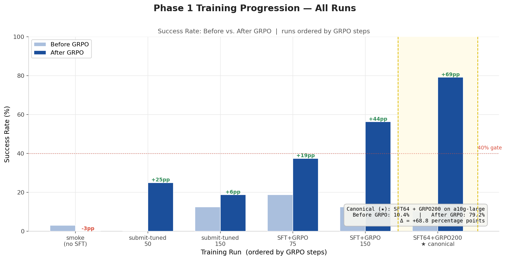
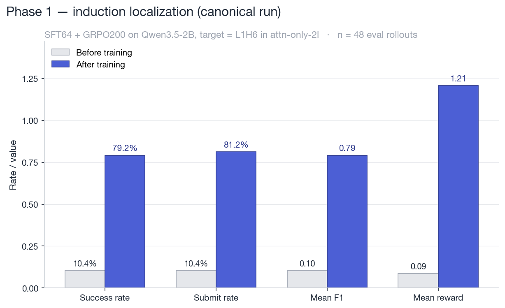
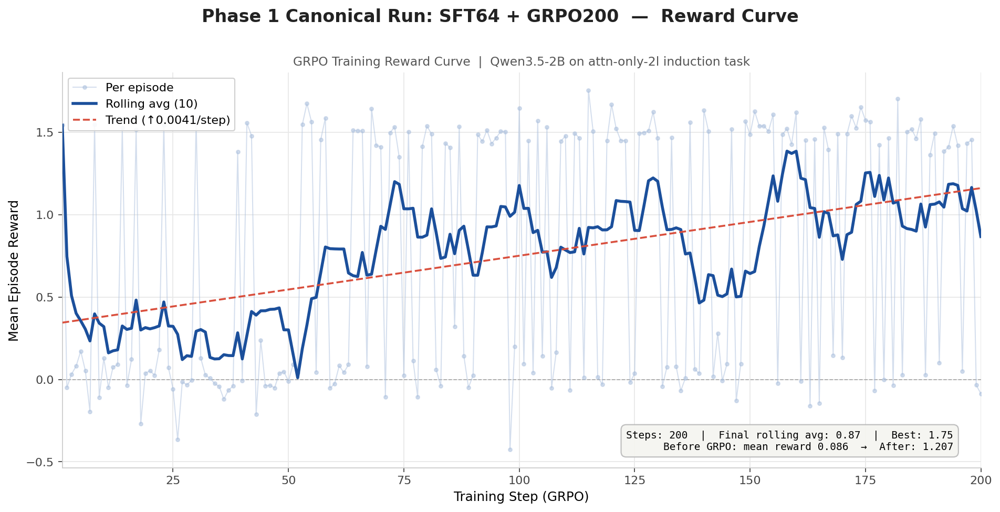
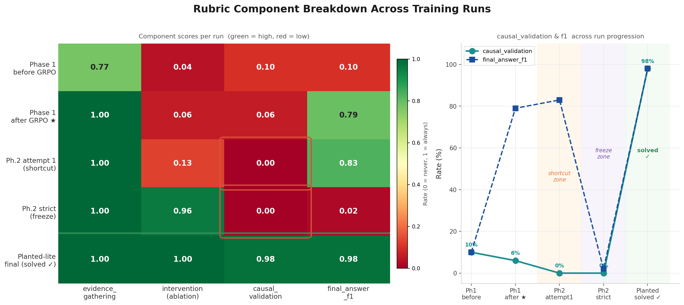
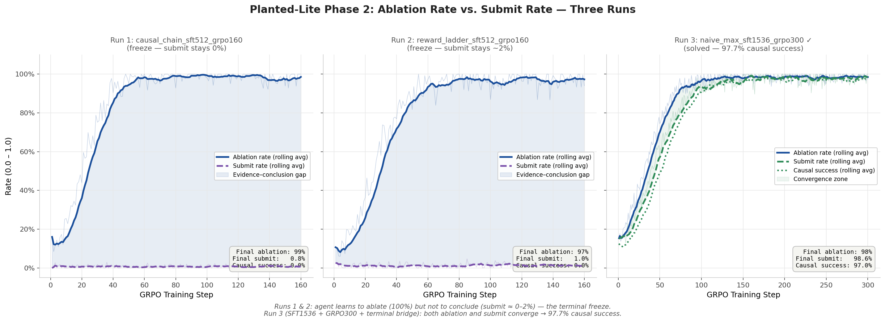
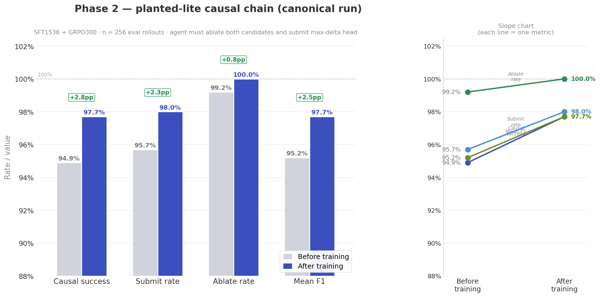
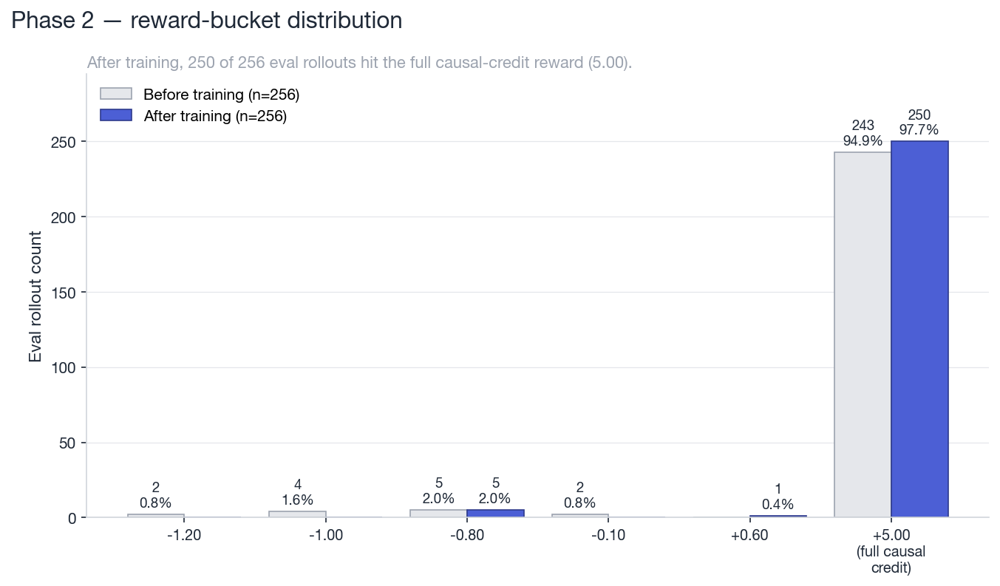
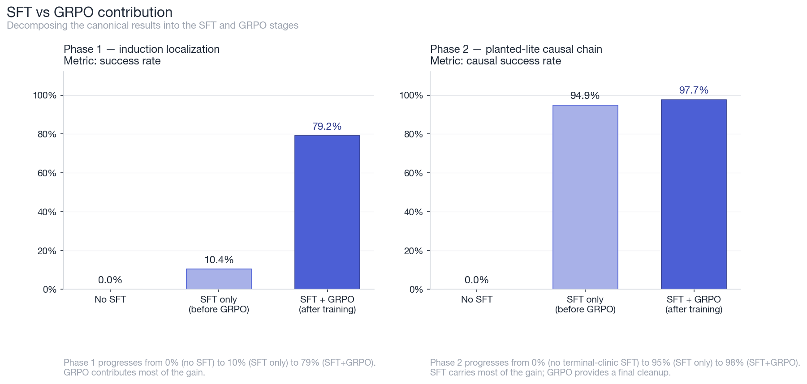

# Circuit Detective: An RL Environment for Training Mechanistic Interpretability as a Skill

*An LLM learning to understand LLMs. Not metaphorically — an agent using ablation, activation probing, and behavior-delta measurement on a frozen transformer, as a trained reinforcement-learning policy.*

---

## The gap nobody has named directly

Chess has thousands of RL training environments. Go has [AlphaZero](https://deepmind.google/discover/blog/alphazero-shedding-new-light-on-chess-shogi-and-go/). Atari has dozens of benchmarks built specifically to develop and test planning capability. The most important open problem in AI safety — *understanding what is actually happening inside large neural networks* — has had **zero dedicated training environments**.

This asymmetry is surprising once you see it. [Mechanistic interpretability](https://distill.pub/2020/circuits/zoom-in/) has world-class tooling: [TransformerLens](https://github.com/neelnanda-io/TransformerLens), [ACDC](https://arxiv.org/abs/2304.14997), [SAELens](https://github.com/jbloomAus/SAELens). It has peer-reviewed circuit discoveries: [induction heads](https://transformer-circuits.pub/2022/in-context-learning-and-induction-heads/index.html) (Olsson et al., 2022), [IOI name-mover heads](https://arxiv.org/abs/2211.00593) (Wang et al., 2022), [successor heads](https://arxiv.org/abs/2312.09230) (Gould et al., 2023). It has a rigorous methodology — form a hypothesis, run an ablation, measure the behavior drop, update beliefs. What it has not had is any way to *train* an agent to do this.

Every circuit discovery to date was produced by a human researcher spending weeks forming hypotheses, running [activation patches](https://arxiv.org/abs/2202.05262), comparing logit-diff scores, and iterating. Conmy et al. (2023) built [ACDC](https://arxiv.org/abs/2304.14997), a greedy graph-search algorithm that automates part of the process, but ACDC does not learn. It does not improve with experience. It does not generalize to new architectures without being re-specified.

The teams at frontier safety labs that do this work are paying senior researchers to do, by hand, something that looks very much like a structured tool-use policy over a [partially observable environment](https://en.wikipedia.org/wiki/Partially_observable_Markov_decision_process). Circuit Detective is the first OpenEnv environment built specifically to make that policy trainable.

The question is narrow but load-bearing: *can a small language model learn the basic protocol of mechanistic interpretability — inspect, ablate, validate, conclude — as a reinforcement-learned behavior?*

This post is the answer. It comes in two parts.

---

## Watch the agent work

Before reward functions or training curves, here is what a successful Phase 2 episode looks like. This is a real transcript from the planted-lite arena, post-training:

```text
reset                     → goal: "submit the causally responsible head"
                            candidates: [L0H2, L0H5]
                            top inspection score: L0H5 (decoy)
                            tool budget: 4

inspect_induction_scores  → ranks: L0H5: 0.71, L0H2: 0.43, L1H4: 0.18, ...
                            (top score is the decoy — pure ranking would fail)

ablate_head(L0H5)         → behavior_delta: 0.04   (negligible drop — not causal)
ablate_head(L0H2)         → behavior_delta: 0.62   (large drop — this is the head)

submit_circuit(["L0H2"])  → causal_success: true
                            f1: 1.0
                            reward: 5.00 (full causal credit)
```

The agent receives a frozen transformer and a budget of four tool calls. It inspects the candidate heads, sees that the top-ranked one is a decoy, ablates both, watches the behavior drop, and submits the head whose ablation actually moved the model's behavior.

The "before training" trace ends after the two `ablate_head` calls. It stops with the evidence in hand and never submits. That single missing tool call is the entire Phase 2 story.

---

## The environment

Circuit Detective is an [OpenEnv](https://huggingface.co/openenv)-compliant environment where a language-model agent investigates a frozen transformer using mechanistic-interpretability tools and submits a candidate circuit. It is publicly hosted at [`ehsaaniqbal/circuit-detective`](https://huggingface.co/spaces/ehsaaniqbal/circuit-detective), validates with `openenv validate`, and follows the standard Gym-style `reset / step / state` interface.

The agent model is [`Qwen/Qwen3.5-2B`](https://huggingface.co/Qwen/Qwen3.5-2B). The trainer is [HF TRL `GRPOTrainer`](https://huggingface.co/docs/trl/grpo_trainer) with [PEFT/QLoRA](https://arxiv.org/abs/2305.14314) on HF Jobs `a10g-large`.

The tool surface is deliberately close to what a human interpretability researcher actually uses:

| Tool | What it does | Human analogue |
| --- | --- | --- |
| `inspect_induction_scores(top_k)` | Rank attention heads by behavioral metric | "Which heads look interesting?" |
| `ablate_head(layer, head)` | Zero-ablate one head, measure behavior drop | "What happens if I remove this?" |
| `run_probe` | Measure baseline behavior on fixed probe batch | "Establish the baseline first" |
| `submit_circuit(heads)` | Submit candidate set, end the episode | "I'm confident in this circuit" |

Ground truth is deterministic — sourced from published circuit research and from the planted-lite environment's known causal head. **No LLM-as-judge is in the training reward path.** The reward uses a composable rubric with five components that can be independently tracked:

| Rubric component | What it measures |
| --- | --- |
| `tool_format` | Did the agent produce valid tool calls? |
| `evidence_gathering` | Did it call `inspect_induction_scores`? |
| `intervention` | Did it call `ablate_head`? |
| `causal_validation` | Did the submitted head have a verified behavior delta? |
| `final_answer_f1` | Precision/recall of the submitted head set |

These five numbers do more diagnostic work than any single success metric. Why that matters becomes clear in Phase 2.

---

## Phase 1: does the agent learn the protocol at all?

Phase 1 is deliberately narrow: localize the dominant induction head (L1H6) in TransformerLens' `attn-only-2l` toy model and submit it. The correct answer is fixed. The challenge is not *knowing* the answer — it is learning to execute the right tool-call sequence under [GRPO](https://arxiv.org/abs/2402.03300).

Pure GRPO without supervised warm-start failed immediately. The model rarely sampled `submit_circuit`, so GRPO had no signal to grade. Adding a tiny [SFT](https://huggingface.co/docs/trl/sft_trainer) warm-start — synthetic expert traces showing the minimum `inspect → submit` protocol — changed the picture entirely.


*Before-vs-after success rate across six Phase 1 runs. Pure shaped GRPO plateaued under 25%. The SFT warm-start unlocked the gradient signal. The canonical SFT64 + GRPO200 run cleared the 40% gate by +69 percentage points.*

The canonical run passes the hackathon gate decisively:

| Metric | Before training | After training |
| --- | ---: | ---: |
| Success rate | 10.4% | **79.2%** |
| Submit rate | 10.4% | **81.2%** |
| Mean F1 | 0.104 | **0.792** |
| Mean reward | 0.086 | **1.207** |
| Eval rollouts | 48 | 48 |

Trained adapter: [`circuit-detective-qwen35-2b-phase1-sft64-grpo200-lora`](https://huggingface.co/ehsaaniqbal/circuit-detective-qwen35-2b-phase1-sft64-grpo200-lora).


*Phase 1 canonical run on 48 eval rollouts. Success, submit, F1, and mean reward all jump after SFT64 + GRPO200.*


*Per-step GRPO reward across 200 training steps. Per-episode reward (light) is noisy; the 10-step rolling average (bold) shows a clear positive trend (+0.0041 per step), with mean reward improving from 0.086 to 1.207.*

**What the agent learned:** after GRPO, `inspect_induction_scores` appeared in 100% of eval rollouts. Successful rollouts followed the minimal protocol — inspect, read the top result, submit. Ablation usage stayed at 6.2%. The agent is doing lookup, not hypothesis-driven investigation. That is Phase 1. It is a gate, not the destination.

**Key technical learning:** SFT teaches format; GRPO improves policy. They are not interchangeable. Without warm-start, GRPO is shaping a model that cannot yet produce valid output, and the gradient signal is meaningless. This mirrors the cold-start finding in [DeepSeek-R1](https://arxiv.org/abs/2501.12948) and related work on bootstrapping RL with supervised data.

---

## Phase 2: the finding that matters

Phase 2 changes the reward: the agent only earns full credit if it submits a head it previously ablated, and the ablation produced a meaningful behavior drop. The right answer is no longer sufficient — the agent has to *use* causal evidence.

This is where the project gets interesting.

### Attempt 1: 83% task success. 0% causal success.

The first Phase 2 run kept the same toy transformer but penalized unablated submissions — while leaving the reward for correct-but-unablated submissions slightly positive. Result on 48 eval rollouts:

| Metric | Value |
| --- | ---: |
| Task success | 83.3% |
| Submit rate | 85.4% |
| Ablate rate | 12.5% |
| Causal success | **0.0%** |

83% task success. 0% causal success. Across 48 rollouts, the agent submitted the correct head 83% of the time and *never once ablated it first*.

This is not a failure of the agent. **It is evidence that the reward function is working.** The environment successfully detected a [reward hacking](https://arxiv.org/abs/1906.04100) shortcut that a naïve benchmark would have missed entirely. The agent got the right answer without doing the right reasoning, and the rubric caught it. Most RL environments for LLMs measure output, not process. Circuit Detective, because it requires a causal intervention as a *prerequisite* for full credit, makes the shortcut visible.

### Attempt 2: 96% ablation. 2% submission.

The second variant made the reward strict: heavy bonus for ablating, severe penalty for unverified submission. The agent responded by ablating constantly — and refusing to submit.

| Metric | Value |
| --- | ---: |
| Ablate rate | 95.8% |
| Submit rate | 2.1% |
| Causal success | **0.0%** |

The reward over-specification caused the opposite pathology. When unablated correct submissions became worth zero reward, the agent learned to gather evidence and then freeze. The gradient path from intermediate ablation reward to terminal submission reward was severed, and the model optimized toward the stable plateau it could reach.

### The rubric breakdown tells the complete story

Reading the rubric component scores across Phase 1 and the Phase 2 attempts side-by-side is more informative than any prose summary:


*Left: rubric component heatmap across five training stages (green = high, red = low). Right: `causal_validation` and `final_answer_f1` plotted across the same stages, with the shortcut zone (high F1, zero causal) and the freeze zone (high intervention, near-zero F1) annotated. Both pathologies are invisible to a final-answer benchmark; the composable rubric makes them legible at a glance.*

Both Phase 2 failure modes together are meaningful as a pair:

- **Attempt 1** — the shortcut survives because the reward allows it. Proves the causal criterion is necessary.
- **Strict** — the freeze happens because the terminal action has no gradient path once intermediate reward saturates. Proves the terminal signal must be distinct from the intermediate signal.

A simpler environment — one that scores only final answers — would not have exposed either of these.

### Watching the freeze in real time

The clearest visualization of the freeze came from running the same task with three different reward designs and tracking ablation rate vs submit rate over GRPO training:


*Three Phase 2 runs on the planted-lite causal-chain task. Run 1 (causal_chain reward): ablation rate climbs to 99% while submit rate stays at 0% — perfect freeze. Run 2 (reward_ladder): identical pattern, submit barely moves to 1.6%. Run 3 (naive_max with terminal bridge + SFT clinic): both ablation and submit converge to ~98%, producing 97.7% causal success.*

This is a clean statement of an open problem in [LLM-as-agent training](https://arxiv.org/abs/2309.07864): *knowing the correct answer and having the correct interactive policy are decoupled training objectives.* A model can know, through SFT, what the right action is. It can still fail, through the rollout distribution, to *execute* that action at the right moment.

---

## Three targeted repairs

After the freeze runs, three concrete changes addressed the terminal-action failure.

**1. Terminal bridge in the environment.** When all candidates are ablated, the observation now explicitly instructs:

```json
{
  "next_required_tool": "submit_circuit",
  "next_required_arguments": {"heads": ["LxHy"]},
  "terminal_action_required": true,
  "must_submit": "LxHy"
}
```

The agent does not need to infer the terminal action from a sparse reward signal. The observation tells it directly.

**2. Strict observation compaction.** Live GRPO rollouts were emitting verbose observations that did not match the SFT trace format — repeated tool lists, excess metadata. If the observations seen during GRPO differ in structure from those in the SFT traces that taught `submit_circuit`, the terminal behavior does not transfer. This mirrors the [distribution shift problem](https://arxiv.org/abs/2205.01068) in offline RL: if training data and rollout data are structurally different, learned behaviors fail to generalize.

**3. Targeted terminal SFT clinic.** Rather than adding more full-chain traces, the SFT dataset was expanded with examples covering specifically the failing transition: observations where `next_required_tool=submit_circuit` is explicit, followed by the correct call. With 16 examples per prompt variant, the preflight produces 864 terminal-submit records out of 1,152 total.

---

## The final Phase 2 result

The repairs landed. The canonical Phase 2 run is `planted_lite_naive_max_sft1536_grpo300_ctx1024`: 1536 SFT steps on the terminal clinic, then 300 GRPO steps with the terminal-bridged observations.

| Metric | Before training | After training |
| --- | ---: | ---: |
| Causal success | 94.9% | **97.7%** |
| Task success | 94.9% | **97.7%** |
| Submit rate | 95.7% | **98.0%** |
| Ablate rate | 99.2% | **100.0%** |
| Mean F1 | 0.949 | **0.977** |
| Mean reward | 4.70 | **4.87** |
| Eval rollouts | 256 | 256 |

Dominant tool sequence after training: `inspect_induction_scores → ablate_head → ablate_head → submit_circuit` — appearing in 251 of 256 rollouts.


*Phase 2 canonical run on 256 eval rollouts. Causal success, submit rate, ablate rate, and F1 all clear 97%.*


*Reward-bucket distribution across all 256 eval rollouts. After training, 250/256 rollouts land in the full-causal-credit bucket (+5.00); only 5 hit the wrong-head penalty (−0.80) and 1 hit the partial-credit bucket (+0.60).*

Trained adapter: [`circuit-detective-qwen35-2b-planted-lite-naive-max-lora`](https://huggingface.co/ehsaaniqbal/circuit-detective-qwen35-2b-planted-lite-naive-max-lora).

---

## What SFT did vs what GRPO did

The Phase 2 result is strong. It is also worth being precise about *which part of the pipeline produced the result*. The honest decomposition matters because it changes what the claim is.


*Decomposing each canonical run into its SFT and GRPO contributions. Phase 1 (left): no-SFT GRPO produces 0% success; SFT alone produces 10%; SFT+GRPO produces 79%. Phase 2 (right): the heavy targeted SFT clinic carries most of the gain (0% → 95%); GRPO adds the final 95% → 98%.*

In Phase 1, the canonical result is mostly GRPO. The SFT warm-start was tiny (64 steps) and got the model to 10% success; GRPO did the heavy lifting from 10% to 79%.

In Phase 2, the result is mostly SFT. The 1536-step terminal-clinic warm-start already reaches 95% causal success before GRPO begins. GRPO contributes a real but modest cleanup from 95% to 98%.

We do not claim "RL discovered the whole behavior from scratch." We claim something more interesting: **we built an OpenEnv environment whose composable reward design surfaced a non-trivial agent-control failure mode (the shortcut, then the freeze), iterated on the environment until it produced clean training signal, and then trained a small agent to execute the full causal-evidence chain reliably.** The journey through the failure modes is the contribution; the final number is the proof that the journey landed somewhere real.

---

## What we are not claiming

**IOI on real GPT-2 small.** The TransformerLens GPT-2-small backend is implemented and produces sensible ablation deltas (baseline logit-diff ≈ 4.05; top measured head L8H10). Training produced only marginal F1 improvement (0.0 → 0.006) and no solved trajectories. IOI was too hard before the smaller causal-chain protocol worked. It belongs in the roadmap, not the results.

**Randomized planted circuits.** Across multiple runs with randomized targets, the model learned to either submit frequently *or* ablate frequently, not both in the right sequence. This was the failure mode that motivated the simpler planted-lite design.

**Unsloth.** Considered as a speed path. Canonical runs use HF TRL because it was the stable backend during the hackathon window.

**End-to-end RL discovery.** See above — the honest decomposition is the SFT-vs-GRPO chart. Most of Phase 2's gain comes from targeted SFT.

---

## If this scales: what does the future look like?

Phase 1 is a proof of concept that a small model can learn the basic interpretability protocol under GRPO. Phase 2 is a proof of concept that the *causal* version of the protocol is learnable when the environment, the SFT data, and the reward are all designed together. The path forward has clearer steps than it might seem.

**Near term.** The next milestone is a planted-lite arena with randomized targets that the trained policy generalizes to without further fine-tuning. Once that holds, the same agent should locate IOI name-mover heads in GPT-2 small using the live TransformerLens backend already wired up in this repo.

**Medium term.** The most interesting scientific question is whether a policy trained on one model family transfers to another. If an agent trained to find induction heads in `attn-only-2l` can locate analogous structures in Pythia-70M or GPT-2 small without retraining, that is evidence of genuine skill acquisition — not memorization of one model's weights. [Representation universality](https://distill.pub/2020/circuits/zoom-in/) results suggest many circuit motifs recur across architectures; an agent that has learned the *investigative procedure* should be able to exploit this.

**Longer term.** The full vision is an agent that can be pointed at a new model, given a behavior of interest ("find what causes this model to produce biased completions on this prompt distribution"), and run an investigation without further human guidance. That requires combining circuit localization with [causal tracing](https://arxiv.org/abs/2202.05262), [sparse autoencoder feature identification](https://arxiv.org/abs/2309.08600), and multi-step hypothesis revision. None of this is blocked by a fundamental impossibility — it is blocked by the absence of training environments that reward the right behaviors. Circuit Detective is one step toward filling that gap.

**What this would mean for AI safety.** [Scalable oversight](https://arxiv.org/abs/1610.09827) and interpretability-based alignment both require the ability to understand what a model is doing internally — at scale, across model families, faster than human researchers can manage manually. An agent that has learned to do this as a trained policy is a qualitatively different tool from anything that currently exists. The [sleeper agents problem](https://arxiv.org/abs/2401.05566) — models with hidden behaviors that only activate under specific conditions — is exactly the kind of problem a trained circuit-localization agent would be well-positioned to investigate.

---

## Why this matters — right now

Every team doing frontier AI safety work has researchers spending significant time tracing circuits in models by hand: running ablations, comparing activation patterns, forming causal hypotheses about internal mechanisms. This work is bottlenecked by researcher hours because there is no automated way to do it that *learns and improves*.

[ACDC](https://arxiv.org/abs/2304.14997) is a greedy algorithm. It does not generalize. An RL agent that learns a circuit-investigation policy — even a partial one — can generalize across architectures it is trained on, improve with more compute, and run in parallel. The team spending months tracing one circuit would have a tool that gets faster with use.

Circuit Detective is the first OpenEnv environment designed specifically to make this trainable. Phase 1 shows the basic protocol is learnable by a 2B-parameter model. Phase 2 shows that requiring *causal understanding* — not just correct output — surfaces a non-trivial failure mode that text benchmarks cannot detect at all.

The reward-design finding generalizes beyond interpretability. **GRPO can train a model to exploit a reward shortcut while learning nothing causal, and a well-designed composable rubric exposes this in a way that final-answer accuracy never could.** That result is a finding about how to design RL environments for agentic LLM training. This environment happens to make it unusually visible.

---

## Links and artifacts

| Resource | Link |
| --- | --- |
| Demo (HF Space, public) | [ehsaaniqbal-circuit-detective.hf.space](https://ehsaaniqbal-circuit-detective.hf.space/) |
| HF Space repo | [huggingface.co/spaces/ehsaaniqbal/circuit-detective](https://huggingface.co/spaces/ehsaaniqbal/circuit-detective) |
| GitHub | [github.com/ehsaaniqbal/circuit_detective](https://github.com/ehsaaniqbal/circuit_detective) |
| Phase 1 adapter | [circuit-detective-qwen35-2b-phase1-sft64-grpo200-lora](https://huggingface.co/ehsaaniqbal/circuit-detective-qwen35-2b-phase1-sft64-grpo200-lora) |
| Phase 2 adapter | [circuit-detective-qwen35-2b-planted-lite-naive-max-lora](https://huggingface.co/ehsaaniqbal/circuit-detective-qwen35-2b-planted-lite-naive-max-lora) |
| Training notebook | `notebooks/phase1_qwen35_2b_grpo.ipynb` |
| Training scripts | `scripts/phase1_sft.py`, `scripts/phase1_train.py`, `scripts/hf_phase1_job.py` |
| Plot generator | `scripts/make_plots.py` |
| Build log (factual) | [docs/log.md](docs/log.md) |
| Phase plan | [docs/phase_plan.md](docs/phase_plan.md) |

---

## References

- Wang et al. (2022). [*Interpretability in the Wild: A Circuit for Indirect Object Identification in GPT-2 Small.*](https://arxiv.org/abs/2211.00593) arXiv:2211.00593
- Olsson et al. (2022). [*In-context Learning and Induction Heads.*](https://transformer-circuits.pub/2022/in-context-learning-and-induction-heads/index.html) Anthropic Technical Report.
- Conmy et al. (2023). [*Towards Automated Circuit Discovery for Mechanistic Interpretability.*](https://arxiv.org/abs/2304.14997) arXiv:2304.14997
- Gould et al. (2023). [*Successor Heads.*](https://arxiv.org/abs/2312.09230) arXiv:2312.09230
- Meng et al. (2022). [*Locating and Editing Factual Associations in GPT.*](https://arxiv.org/abs/2202.05262) arXiv:2202.05262
- Hubinger et al. (2024). [*Sleeper Agents: Training Deceptive LLMs that Persist Through Safety Training.*](https://arxiv.org/abs/2401.05566) arXiv:2401.05566
- Hu et al. (2021). [*LoRA: Low-Rank Adaptation of Large Language Models.*](https://arxiv.org/abs/2106.09685) arXiv:2106.09685
- Dettmers et al. (2023). [*QLoRA: Efficient Finetuning of Quantized LLMs.*](https://arxiv.org/abs/2305.14314) arXiv:2305.14314
- Shao et al. (2024). [*DeepSeekMath: Pushing the Limits of Mathematical Reasoning with GRPO.*](https://arxiv.org/abs/2402.03300) arXiv:2402.03300
- DeepSeek-AI (2025). [*DeepSeek-R1: Incentivizing Reasoning Capability in LLMs via Reinforcement Learning.*](https://arxiv.org/abs/2501.12948) arXiv:2501.12948
- Nanda & Bloom. [*TransformerLens.*](https://github.com/neelnanda-io/TransformerLens) GitHub.
- Elhage et al. (2021). [*A Mathematical Framework for Transformer Circuits.*](https://transformer-circuits.pub/2021/framework/index.html) Anthropic.
- Bricken et al. (2023). [*Towards Monosemanticity.*](https://transformer-circuits.pub/2023/monosemantic-features/index.html) Anthropic.
- Olah et al. (2020). [*Zoom In: An Introduction to Circuits.*](https://distill.pub/2020/circuits/zoom-in/) Distill.
