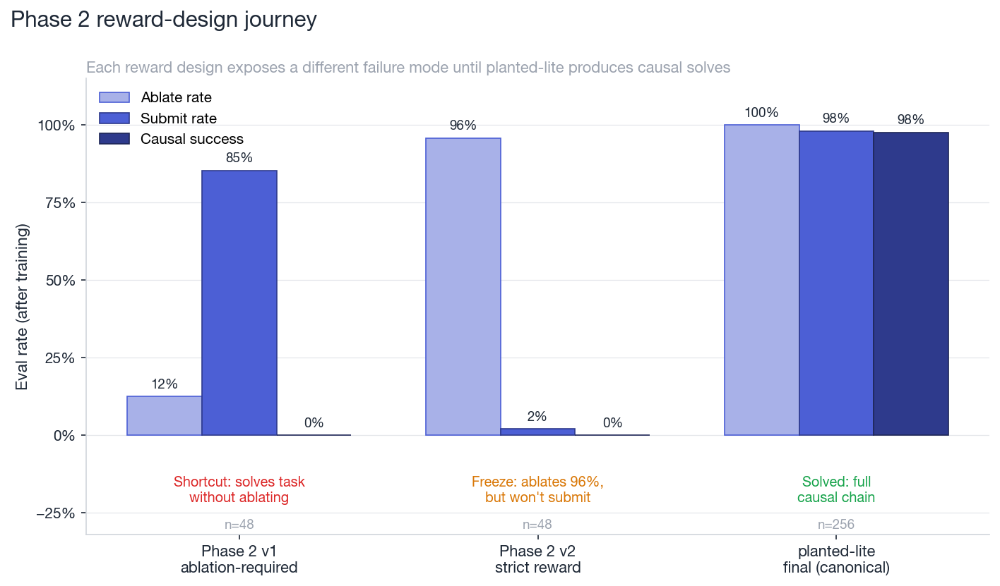

# Circuit Detective

**An OpenEnv reinforcement-learning environment for training small language models to do mechanistic interpretability — inspect, ablate, validate, conclude — as a learned tool-use policy.**

> **▶ Try the demo first:** [ehsaaniqbal-circuit-detective.hf.space](https://ehsaaniqbal-circuit-detective.hf.space/) — a story-first walkthrough of the problem, the tool loop, and a side-by-side baseline-vs-causal-agent replay. Open it before reading on if you want the 90-second intuition for what this environment is for.

| Resource                | Link                                                                                                                                                  |
| ----------------------- | ----------------------------------------------------------------------------------------------------------------------------------------------------- |
| Demo (HF Space, public) | [ehsaaniqbal-circuit-detective.hf.space](https://ehsaaniqbal-circuit-detective.hf.space/)                                                             |
| HF Space repo           | [huggingface.co/spaces/ehsaaniqbal/circuit-detective](https://huggingface.co/spaces/ehsaaniqbal/circuit-detective)                                    |
| GitHub                  | [github.com/ehsaaniqbal/circuit_detective](https://github.com/ehsaaniqbal/circuit_detective)                                                          |
| Phase 1 adapter         | [circuit-detective-qwen35-2b-phase1-sft64-grpo200-lora](https://huggingface.co/ehsaaniqbal/circuit-detective-qwen35-2b-phase1-sft64-grpo200-lora)     |
| Phase 2 adapter         | [circuit-detective-qwen35-2b-planted-lite-naive-max-lora](https://huggingface.co/ehsaaniqbal/circuit-detective-qwen35-2b-planted-lite-naive-max-lora) |
| Mini-blog (in repo)     | [BLOG.md](BLOG.md)                                                                                                                                    |
| Build log (in repo)     | [docs/log.md](docs/log.md)                                                                                                                            |
| Phase plan (in repo)    | [docs/phase_plan.md](docs/phase_plan.md)                                                                                                              |
| Architecture (in repo)  | [docs/ARCHITECTURE.md](docs/ARCHITECTURE.md)                                                                                                          |

## The capability gap

Chess has thousands of RL training environments. Atari has dozens. The most important open problem in AI safety — *understanding what is happening inside large neural networks* — has had **zero dedicated training environments**.

Mechanistic interpretability has world-class tooling (TransformerLens, ACDC, SAELens) and peer-reviewed circuit discoveries (induction heads, IOI name-movers, successor heads). What it does not have is a way to *train* a model to do interpretability work. Every published circuit was found by a human researcher running ablations and reading logit-diffs by hand.

Circuit Detective is the first OpenEnv environment built specifically to make that workflow trainable. The core question is narrow: **can a small language model learn the basic protocol of mechanistic interpretability — inspect, ablate, validate, submit — as a reinforcement-learned behavior?**

This submission shows two things end-to-end:

1. **Phase 1: a small agent learns the protocol.** Qwen3.5-2B trained with SFT + TRL GRPO learns to localize the dominant induction head in TransformerLens' `attn-only-2l` toy model, going from **10.4% → 79.2%** success on 48 eval rollouts.
2. **Phase 2: causal validation is the actually-hard part — and the environment exposes that.** A naive "require ablation" reward is trivially gamed (83% task success, 0% causal success). A strict reward causes the agent to ablate but freeze before submitting. After three reward-design iterations, the planted-lite arena trains an agent that runs the full causal chain and reaches **97.7% causal success on 256 eval rollouts**.

The environment, the training pipeline, the reward-design failure modes, and the repairs are all included.

## Hackathon themes

**Wild Card (Theme 5)** — primary. There is no existing category for "RL-trainable mechanistic interpretability"; this submission opens that lane. Judges who care about ambitious-and-original problems should read this as the load-bearing claim.

**World Modeling — Professional Tasks (Theme 3.1)** — secondary. The agent operates as a junior interpretability researcher: forms hypotheses, runs interventions on a partially observable system (a frozen transformer), updates beliefs from causal evidence, and submits a verifiable conclusion.

## Watch the agent work

Real transcript from a Phase 2 planted-lite eval rollout (canonical run, after training):

```text
reset                     → goal: "submit the causally responsible head"
                            candidates: [L0H2, L0H5]
                            top inspection score: L0H5 (decoy)
                            tool budget: 4

inspect_induction_scores  → ranks: L0H5: 0.71, L0H2: 0.43, L1H4: 0.18, ...
                            (top score is the decoy — pure ranking would fail)

ablate_head(L0H5)         → behavior_delta: 0.04   (negligible drop — not causal)
ablate_head(L0H2)         → behavior_delta: 0.62   (large drop — this is the head)

submit_circuit(["L0H2"])  → causal_success: true
                            f1: 1.0
                            reward: 5.00 (full causal credit)
```

The "before training" trace ends after the two `ablate_head` calls — it stops with the evidence in hand and never submits. That single missing tool call is the entire Phase 2 story.

## How the environment works

| Component           | What it does                                                                                                                                                                |
| ------------------- | --------------------------------------------------------------------------------------------------------------------------------------------------------------------------- |
| `reset`             | Initializes a frozen transformer (TransformerLens `attn-only-2l` for Phase 1, planted-lite synthetic causal chain for Phase 2) and returns the agent's initial observation. |
| `step(tool_call)`   | Executes a tool against the frozen target and returns the next observation, reward, and `done`.                                                                             |
| `state`             | Returns the current episode state for diagnostics.                                                                                                                          |
| `openenv.yaml`      | Standard OpenEnv manifest (validates with `uv run openenv validate`).                                                                                                       |
| Client/server split | Client never imports server internals; the deployed environment uses the standard Gym-style API.                                                                            |

### The tool surface

| Tool                              | What it does                                        | Human analogue                   |
| --------------------------------- | --------------------------------------------------- | -------------------------------- |
| `list_tools`                      | Returns the available tools                         | "What can I use?"                |
| `run_probe`                       | Measures baseline behavior on a fixed probe batch   | "Establish the baseline first"   |
| `inspect_induction_scores(top_k)` | Ranks attention heads by a behavioral metric        | "Which heads look interesting?"  |
| `ablate_head(layer, head)`        | Zero-ablates one head and returns the behavior drop | "What happens if I remove this?" |
| `submit_circuit(heads)`           | Submits the candidate set and ends the episode      | "I'm confident in this circuit"  |

### Reward design

Ground truth is deterministic — sourced from published circuit research and from the planted-lite environment's known causal head. **No LLM-as-judge is in the training reward path.**

The deployed OpenEnv reward is deterministic. The TRL training wrapper adds dense shaped rollout reward to make GRPO learnable, decomposed into named rubric components: `tool_format`, `evidence_gathering` (inspect), `intervention` (ablate), `causal_validation` (submitted head was actually ablated and produced a meaningful behavior drop), and `final_answer_f1`. This decomposition turned out to be the diagnostic difference between Phase 2 attempts that looked like progress and ones that actually were.

## Phase 1 — induction localization

Phase 1 is deliberately narrow: localize the dominant induction head (L1H6) in TransformerLens' `attn-only-2l` toy model. The correct answer is fixed; the challenge is learning to execute the right tool sequence under GRPO.

### Canonical result — `phase1_sft64_grpo200_a10g_large`

| Metric        | Before training | After training |
| ------------- | --------------: | -------------: |
| Success rate  |           10.4% |      **79.2%** |
| Submit rate   |           10.4% |      **81.2%** |
| Mean F1       |           0.104 |      **0.792** |
| Mean reward   |           0.086 |      **1.207** |
| Eval rollouts |              48 |             48 |

Phase 1 gate (≥40% success on ≥32 rollouts): **PASS**.


*Phase 1 canonical run: success rate, submit rate, F1, and mean reward jump after SFT64 + GRPO200, evaluated on 48 rollouts of the `attn-only-2l` induction task.*

### The iteration journey

Pure GRPO without supervised warm-start failed immediately — the policy almost never sampled `submit_circuit`, so GRPO had nothing to grade. A tiny SFT warm-start fixed coverage; GRPO then refined the policy.


*Before-vs-after success rate across six Phase 1 runs, ordered by GRPO steps. Pure GRPO with shaped rewards plateaued well below 40%. The SFT warm-start unlocked the gradient signal. The canonical SFT64 + GRPO200 run clears the 40% gate by +69 percentage points.*

### Per-step training curve


*Per-step GRPO mean reward across 200 training steps for the canonical Phase 1 run, with 10-step rolling average and linear trend overlay. Mean reward improved from 0.086 (before GRPO) to 1.207 (after) with a steady positive trend (+0.0041 per step).*

## Phase 2 — causal validation

Phase 2 changes the rules: the agent only earns full credit if it submits a head it previously ablated, and the ablation produced a meaningful behavior drop. The right answer alone is not sufficient — the agent has to *use* causal evidence.

This is where the project gets interesting.

### The reward-design journey

We ran three Phase 2 variants. Each exposed a different failure mode that a final-answer-only benchmark would have missed entirely.


*Three Phase 2 attempts. v1 (`ablation-required`): high task success, but 0% causal success — the agent learned to submit without ablating because the reward still allowed correct-but-unverified submissions. v2 (`strict reward`): heavy reward for ablation, severe penalty for unverified submission — the agent ablated 96% of the time but stopped before submitting (no gradient path from intermediate evidence to terminal action). Final (`planted-lite`, canonical): repaired observations + terminal SFT clinic + GRPO — full causal chain, 98% causal success.*

This is the central methodological finding: **a final-answer benchmark would have called Phase 2 v1 a success.** The composable rubric and the explicit causal-success metric are what made the shortcut visible.


*Left: rubric component heatmap across five training stages (green = high, red = low). Right: causal_validation and final_answer_f1 plotted across the same stages, with the shortcut zone (high F1, zero causal) and the freeze zone (high intervention, near-zero F1) annotated. Both pathologies are invisible to a final-answer benchmark; the composable rubric makes them legible at a glance.*

### Canonical Phase 2 result — `planted_lite_naive_max_sft1536_grpo300_ctx1024`

The planted-lite arena always ranks a decoy head highest in `inspect_induction_scores`. To get the right answer, the agent must ablate both candidates and submit the one with the larger behavior delta.

| Metric         | Before training | After training |
| -------------- | --------------: | -------------: |
| Causal success |           94.9% |      **97.7%** |
| Submit rate    |           95.7% |      **98.0%** |
| Ablate rate    |           99.2% |     **100.0%** |
| Mean F1        |           0.949 |      **0.977** |
| Mean reward    |            4.70 |       **4.87** |
| Eval rollouts  |             256 |            256 |

Dominant tool sequence after training: `inspect_induction_scores → ablate_head → ablate_head → submit_circuit` (251/256 rollouts).


*Phase 2 canonical run on 256 eval rollouts. Causal success, submit rate, ablate rate, and F1 all clear 97%.*


*Reward-bucket distribution across all 256 eval rollouts. After training, 250/256 rollouts land in the full-causal-credit bucket (+5.00), 5 hit the wrong-head penalty (−0.80), 1 hit the partial-credit bucket (+0.60).*

### What SFT did vs. what GRPO did

Honest decomposition: in Phase 1 the canonical result is mostly GRPO; in Phase 2 it is mostly SFT, with GRPO providing a final cleanup from already-high pre-GRPO performance. The composable rubric and the iteration through Phase 2 v1 → v2 → planted-lite are what unlocked the SFT data the model needed in the first place.


*Decomposing each canonical run into its SFT and GRPO contributions. Phase 1 (left): no-SFT GRPO produces 0% success; SFT alone produces 10%; SFT+GRPO produces 79%. Phase 2 (right): the heavy targeted SFT clinic carries most of the gain (0% → 95%); GRPO adds the final 95% → 98%.*

We do not claim "RL discovered the whole behavior from scratch." We claim something more interesting: we built an OpenEnv environment whose reward design surfaced a non-trivial agent-control failure, iterated on the environment until it produced clean training signal, and then trained a small agent to execute the full causal-evidence chain reliably.

## What we are not claiming

- **IOI on real GPT-2 small.** The TransformerLens GPT-2-small backend is implemented and produces sensible ablation deltas (baseline logit-diff ≈ 4.05; top measured head L8H10), but training produced only marginal F1 improvement (0.0 → 0.006) and no solved trajectories. IOI was too hard before the smaller causal-chain protocol worked. Framed as a stretch.
- **Randomized planted circuits.** Across multiple runs, the model learned to either submit frequently *or* ablate frequently, not both in the right sequence. This was the failure mode that motivated the simpler planted-lite design.
- **Unsloth.** Considered as a speed path. Canonical runs use HF TRL because it was the stable backend during the hackathon window.
- **"GRPO discovered everything."** Honest decomposition is in the SFT-vs-GRPO chart above.

## Training pipeline

| Component               | Choice                                       |
| ----------------------- | -------------------------------------------- |
| Agent model             | `Qwen/Qwen3.5-2B`                            |
| Trainer                 | HF TRL `GRPOTrainer` + supervised warm-start |
| Memory path             | PEFT/QLoRA + bitsandbytes                    |
| Compute                 | HF Jobs `a10g-large`                         |
| Frozen target (Phase 1) | TransformerLens `attn-only-2l`               |
| Frozen target (Phase 2) | Planted-lite synthetic causal chain          |

Canonical Phase 2 hyperparameters (planted-lite naive-max):

| Parameter                   | Value                                                      |
| --------------------------- | ---------------------------------------------------------- |
| Start adapter               | `circuit-detective-qwen35-2b-phase1-sft64-grpo200-lora`    |
| SFT steps                   | 1536 (`16` examples per prompt, max seq len 2048, LR 8e-6) |
| GRPO steps                  | 300 (`8` generations per prompt, eval every-end, LR 5e-6)  |
| Max completion length       | 1024                                                       |
| Max tool-calling iterations | 4                                                          |

**All canonical runs were trained via the scripts below on HF Jobs `a10g-large`, not via Colab.** The notebook is provided as an alternative entry point for judges who want to re-run the pipeline interactively, but it was not used to produce the canonical adapters.

Training entrypoints:

- Scripts (canonical path): `scripts/phase1_sft.py`, `scripts/phase1_train.py`, `scripts/hf_phase1_job.py`
- Notebook (alternative reproduction path): `notebooks/phase1_qwen35_2b_grpo.ipynb`
- Plot generator: `scripts/make_plots.py` (regenerates the assets in `assets/` from artifact JSONs)
- Run summarizer: `scripts/analyze_phase1_run.py`

## Local development

```bash
uv venv --python 3.11
source .venv/bin/activate
uv sync --extra dev
uv venv .venv-tlens --python 3.11
HF_HUB_DISABLE_XET=1 uv pip install --torch-backend cpu \
    --python .venv-tlens/bin/python transformer-lens==2.18.0
uv run server --port 8000
```

In another shell:

```bash
uv run python scripts/validator_smoke.py
uv run openenv validate
```

The `openenv-core` and `transformer-lens` dependencies have incompatible `beartype` constraints, so the live transformer backend runs in a dedicated `.venv-tlens` sidecar process. The TRL training wrapper exposes the tool surface through explicit Python tool methods so GRPO sees a clean action space.

## Repository layout

```text
circuit_detective/
├── __init__.py
├── client.py                    # OpenEnv client
├── models.py                    # Pydantic request/response models
├── openenv.yaml                 # OpenEnv manifest (validates)
├── pyproject.toml
├── phase1_grpo.py               # TRL training wrapper + reward shaping
├── server/                      # OpenEnv environment server
├── scripts/
│   ├── phase1_sft.py            # Tiny SFT warm-start
│   ├── phase1_train.py          # GRPO trainer entrypoint
│   ├── hf_phase1_job.py         # HF Jobs launcher
│   ├── make_plots.py            # Regenerates assets/*.png from JSON metrics
│   ├── analyze_phase1_run.py    # Summarizes phase1_eval_metrics.json files
│   ├── validator_smoke.py       # Local OpenEnv validator
│   └── real_ioi_smoke.py        # Real GPT-2-small IOI backend smoke
├── notebooks/
│   └── phase1_qwen35_2b_grpo.ipynb
├── assets/                      # Polished plots embedded in README/BLOG
├── artifacts/                   # Per-run training artifacts (eval JSONs + curves)
├── docs/
│   ├── phase_plan.md            # Execution plan
│   ├── log.md                   # Factual experiment log
│   └── circuit_detective_brief.md
└── tests/
```

## Why this matters

Frontier AI safety teams have researchers spending significant time tracing circuits in models by hand: running ablations, comparing activation patterns, forming causal hypotheses. ACDC (Conmy et al. 2023) automates part of this with greedy graph search but does not learn or generalize. An RL-trained policy that learns the *investigative procedure* could in principle generalize across architectures, improve with compute, and run in parallel.

This submission is one step toward that: the first OpenEnv environment whose reward signal explicitly distinguishes "got the right answer" from "did the right reasoning." The composable rubric exposed a reward-hacking failure mode (Phase 2 v1: 83% task success, 0% causal success) that a final-answer benchmark would have shipped as a win. That methodology generalizes well beyond mechanistic interpretability.

## References

- Wang et al. (2022). [Interpretability in the Wild: A Circuit for Indirect Object Identification in GPT-2 Small.](https://arxiv.org/abs/2211.00593)
- Olsson et al. (2022). [In-context Learning and Induction Heads.](https://transformer-circuits.pub/2022/in-context-learning-and-induction-heads/index.html)
- Conmy et al. (2023). [Towards Automated Circuit Discovery for Mechanistic Interpretability.](https://arxiv.org/abs/2304.14997)
- Gould et al. (2023). [Successor Heads.](https://arxiv.org/abs/2312.09230)
- Meng et al. (2022). [Locating and Editing Factual Associations in GPT.](https://arxiv.org/abs/2202.05262)
- Shao et al. (2024). [DeepSeekMath: Pushing the Limits of Mathematical Reasoning with GRPO.](https://arxiv.org/abs/2402.03300)
- Dettmers et al. (2023). [QLoRA: Efficient Finetuning of Quantized LLMs.](https://arxiv.org/abs/2305.14314)
- Nanda & Bloom. [TransformerLens.](https://github.com/neelnanda-io/TransformerLens)
- Elhage et al. (2021). [A Mathematical Framework for Transformer Circuits.](https://transformer-circuits.pub/2021/framework/index.html)
