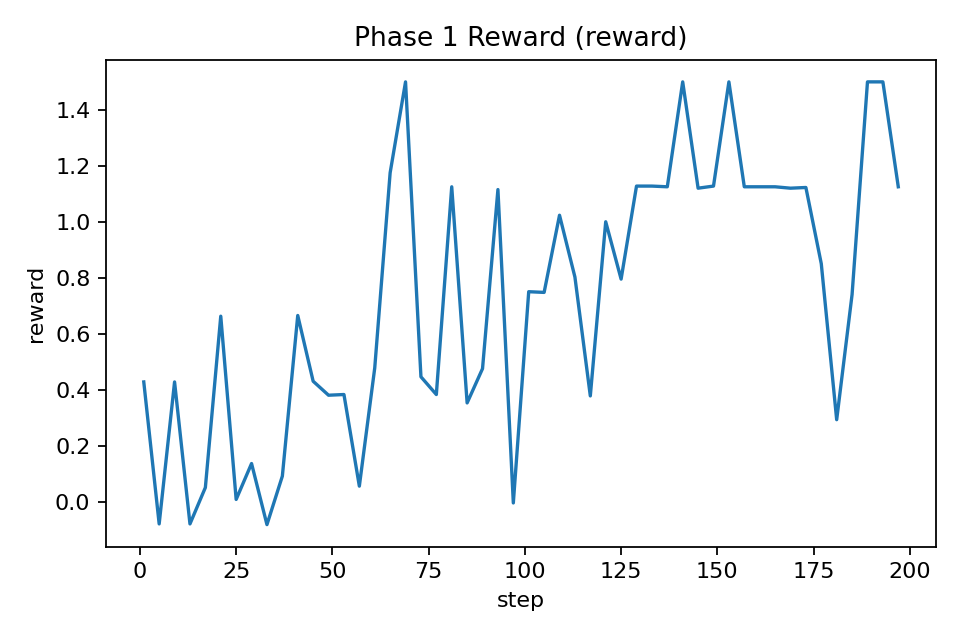
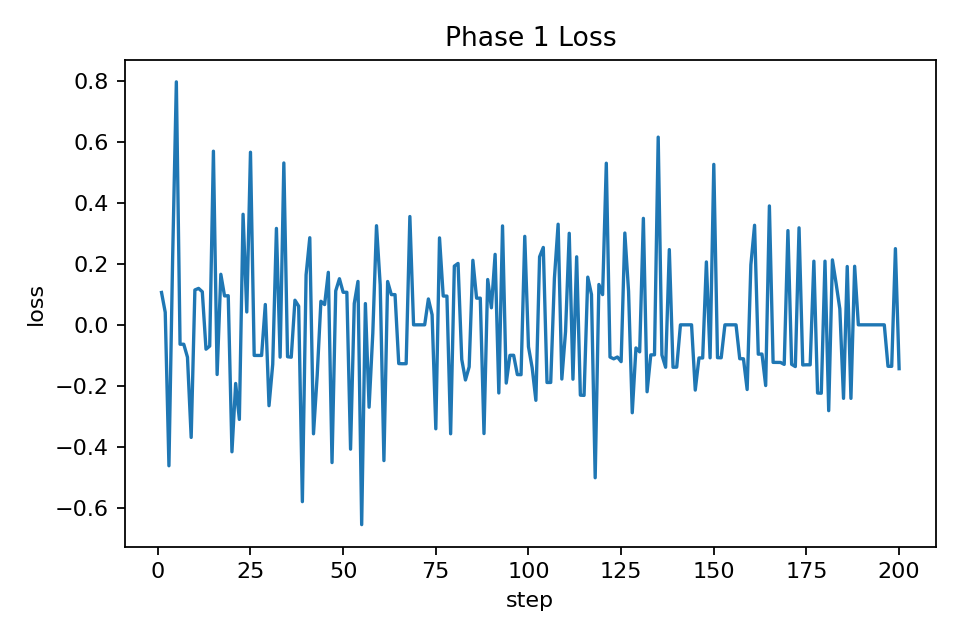

# Circuit Detective

Circuit Detective is an OpenEnv environment for training an agent to localize circuits in frozen transformers.

Public Space: https://huggingface.co/spaces/ehsaaniqbal/circuit-detective
GitHub repo: https://github.com/ehsaaniqbal/circuit_detective

The current implementation is intentionally narrow: **Phase 1 only**. It targets induction localization in TransformerLens' `attn-only-2l` toy model and exposes a small, deterministic tool surface:

- `list_tools`
- `run_probe`
- `inspect_induction_scores`
- `ablate_head`
- `submit_circuit`

The environment package is OpenEnv-valid and runnable locally with Gym-style `reset`, `step`, and `state`. The deployed OpenEnv reward remains deterministic; the TRL training wrapper adds shaped rollout rewards so Phase 1 GRPO receives nonzero signal during exploration.

Phase 2 is implemented as an additive ablation-required curriculum mode. It keeps the same toy-transformer backend but only grants full credit when the submitted head was first ablated and the intervention produced a meaningful behavior drop. The current canonical trained result is still Phase 1; Phase 2 training is the next run.

## Phase 1 Result

Canonical run: `ehsaaniqbal/69ecd77ad2c8bd8662bcdd0b` on HF Jobs `a10g-large`.

The current best agent uses a tiny SFT warm-start followed by TRL GRPO on `Qwen/Qwen3.5-2B`. The before metric below is after the SFT warm-start and before GRPO, not the raw base model. The final LoRA adapter is public at `ehsaaniqbal/circuit-detective-qwen35-2b-phase1-sft64-grpo200-lora`.

| Metric | Before GRPO | After GRPO |
| --- | ---: | ---: |
| Success rate | 10.4% | 79.2% |
| Submit rate | 10.4% | 81.2% |
| Mean reward | 0.0858 | 1.2072 |
| Mean F1 | 0.1042 | 0.7917 |
| Eval rollouts | 48 | 48 |

Phase 1 gate: **PASS** (`>=40%` success on `>=32` eval rollouts).





Run summary:

```bash
uv run python scripts/analyze_phase1_run.py artifacts/phase1_sft64_grpo200_a10g_large
```

## Deliverables

- HF Space: https://huggingface.co/spaces/ehsaaniqbal/circuit-detective
- Training notebook: `notebooks/phase1_qwen35_2b_grpo.ipynb`
- Training scripts: `scripts/phase1_sft.py`, `scripts/phase1_train.py`, `scripts/hf_phase1_job.py`
- Phase plan: `docs/phase_plan.md`
- Canonical training evidence: `artifacts/phase1_sft64_grpo200_a10g_large/`
- Trained Phase 1 LoRA adapter: `ehsaaniqbal/circuit-detective-qwen35-2b-phase1-sft64-grpo200-lora`
- Writeup: `docs/writeup.md`

Notebook-first training entrypoint:

- `notebooks/phase1_qwen35_2b_grpo.ipynb`
- `scripts/phase1_train.py` (`--backend trl` is the current smoke path; Unsloth needs a compatible TRL pin)
- `scripts/phase1_sft.py` (optional tiny warm-start for the Phase 1 tool protocol)
- `scripts/hf_phase1_job.py`

Execution plan:

- `docs/phase_plan.md`

## Local Development

```bash
uv venv --python 3.11
source .venv/bin/activate
uv sync --extra dev
uv venv .venv-tlens --python 3.11
HF_HUB_DISABLE_XET=1 uv pip install --torch-backend cpu --python .venv-tlens/bin/python transformer-lens==2.18.0
uv run server --port 8000
```

In another shell:

```bash
uv run python scripts/validator_smoke.py
```

## Current Scope

- One scenario: `l1_induction_attn_only_2l`
- Additive Phase 2 training mode: `l2_ablation_required`
- One dominant-head submission target derived deterministically from a fixed induction metric on the chosen checkpoint
- Deterministic OpenEnv reward, with trainer-side shaped rollout reward for Phase 1 GRPO
- Split runtimes by necessity: `openenv-core` and `transformer-lens` currently have incompatible `beartype` constraints, so the live backend runs in a dedicated `.venv-tlens` sidecar process
- Training wrapper uses explicit public Python tool methods for TRL `environment_factory`, while the deployed environment keeps the OpenEnv `reset` / `step` / `state` surface

## Repository Layout

```text
circuit_detective/
├── __init__.py
├── client.py
├── models.py
├── openenv.yaml
├── pyproject.toml
├── scripts/
├── server/
└── tests/
```
