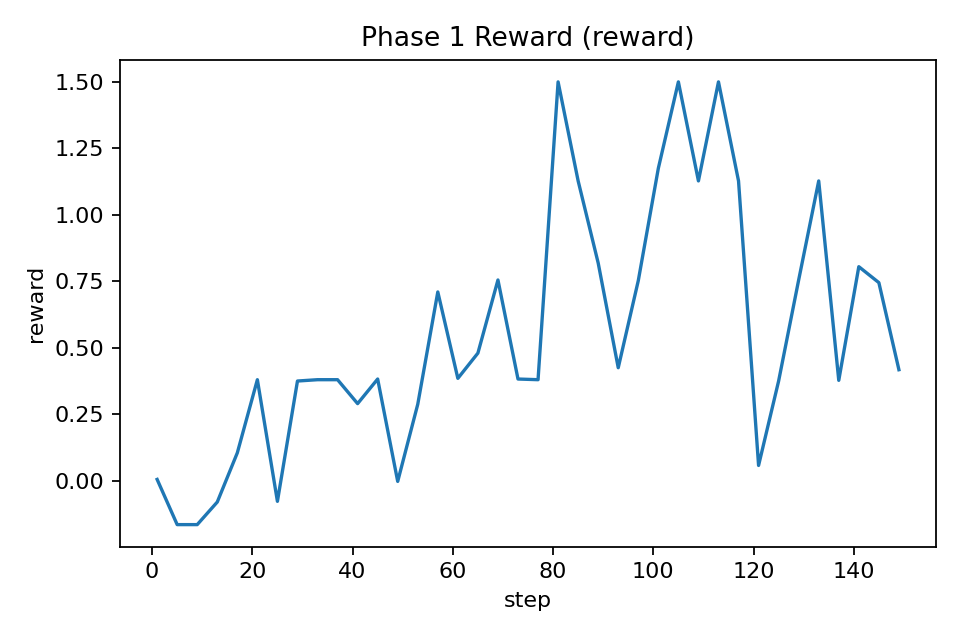
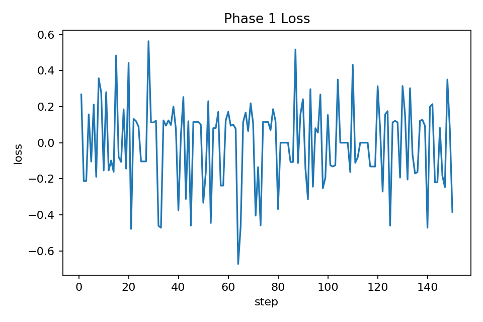

# Circuit Detective: RL Agents for Mechanistic-Interpretability Tool Use

Circuit Detective is an OpenEnv environment where a language-model agent has to investigate a frozen transformer with mechanistic-interpretability tools, then submit a candidate circuit. The current submission focuses on Phase 1: localizing the dominant induction head in TransformerLens `attn-only-2l`.

The goal is not to claim broad automated interpretability yet. The goal is narrower and testable: can a small agent learn the basic protocol of inspecting a transformer, selecting a candidate head, and submitting that circuit through an OpenEnv task interface?

## Environment

Phase 1 exposes a deterministic tool surface:

- `list_tools`
- `run_probe`
- `inspect_induction_scores`
- `ablate_head`
- `submit_circuit`

The OpenEnv environment keeps a standard `reset` / `step` / `state` interface and a deterministic terminal reward. The training wrapper adds dense trainer-side shaping so GRPO receives useful signal before the final submission.

The current target is a fixed two-layer attention-only toy transformer. The environment computes a deterministic answer key from the backend and scores candidate submissions by precision, recall, F1, and step efficiency.

## Training Setup

The agent model is `Qwen/Qwen3.5-2B`. The successful training recipe uses:

- Tiny SFT warm-start to teach the tool-call protocol.
- HF TRL `GRPOTrainer` for reinforcement learning.
- PEFT/QLoRA with bitsandbytes for GPU efficiency.
- HF Jobs `a10g-large` for the canonical passing run.

Unsloth remains a plausible future optimization, but the current passing run uses the TRL path because it was the fastest stable implementation path during the hackathon window.

## Result

Canonical run: `ehsaaniqbal/69ecc704d70108f37acde716`.

The before metric is after SFT warm-start and before GRPO, not the raw base model.

| Metric | Before GRPO | After GRPO |
| --- | ---: | ---: |
| Success rate | 12.5% | 56.2% |
| Submit rate | 12.5% | 59.4% |
| Mean reward | 0.0888 | 0.8879 |
| Mean F1 | 0.1250 | 0.5781 |
| Eval rollouts | 32 | 32 |

The Phase 1 gate was `>=40%` success on at least `32` eval rollouts, so this run passes the de-risk milestone.





## What The Agent Learned

The trained policy reliably enters the intended investigation loop. After GRPO, `inspect_induction_scores` appeared in 100% of eval rollouts, and successful rollouts generally followed the simple Phase 1 protocol:

```text
inspect_induction_scores(top_k=3) -> submit_circuit([top_head])
```

This is useful because the agent is not only producing a text answer; it is learning to interact with an environment, call the relevant interpretability tool, and terminate with a scored circuit submission.

## Limitations

The current result is intentionally narrow. Ablation use is still low, so this is best described as successful Phase 1 circuit localization rather than a rich causal-investigation agent. The next level should require ablation for full reward and introduce decoy heads so score-ranking alone is insufficient.

The final trained adapter from the first passing run was not uploaded before the ephemeral HF Job ended. The repository therefore freezes the evaluation evidence for that run, and subsequent candidate runs are configured to upload the final LoRA adapter automatically.

## Next Steps

The next engineering step is Phase 2: make the task require causal validation. The planned change is to keep inspection useful, but reserve full terminal reward for trajectories that inspect a candidate, ablate that candidate, observe the behavior drop, and only then submit.

Longer term, Circuit Detective can expand from toy induction to other verified circuit tasks, but the implementation should keep claims conservative and only include ground truth that has been checked against source material.
